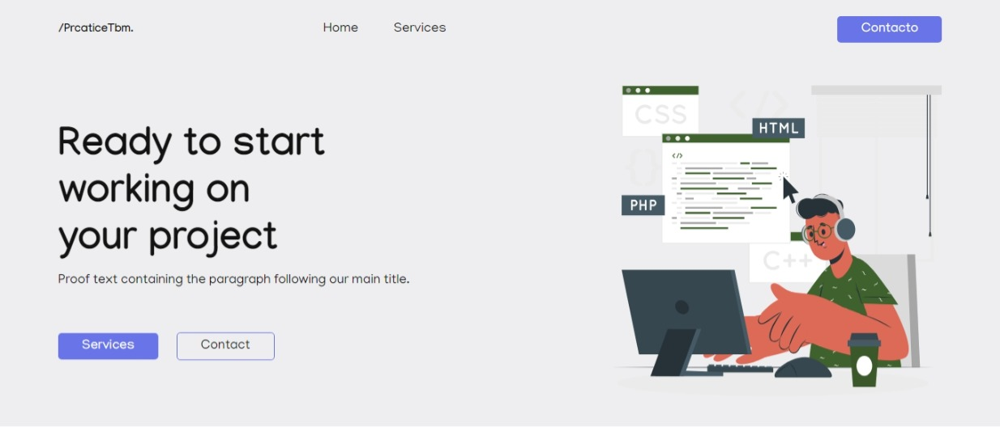
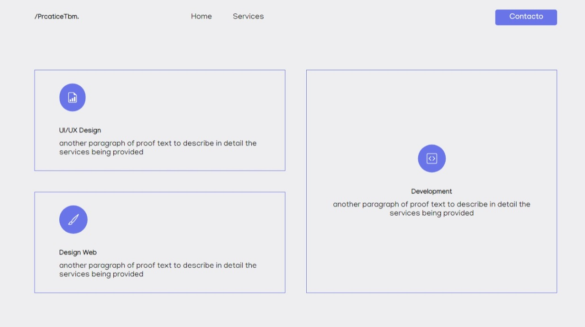
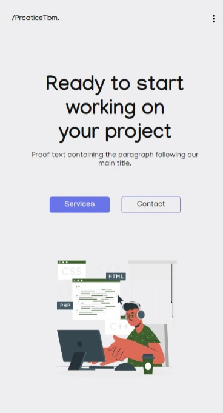
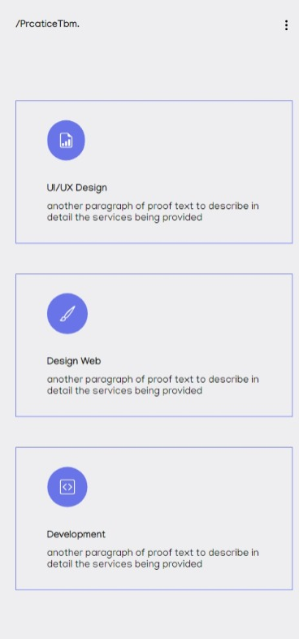

## Práctica de Maquetado y Routes con React Js

**Descripción:** Práctica de maquetado en react js a partir de un diseño web responsive realizado previamente en figma, y práctica de rutas en react js con dos páginas iniciales como ejemplo (Home y Services).

**Nota:** los recursos gráficos fueron tomados de la web con fines de práctica y aprendizaje.

**Visualización en tamaño Desktop:**

**Página Home:**

**Página Services:**

**Visualización en tamaño Movil:** 

**Página Home:**

**Página services:**

